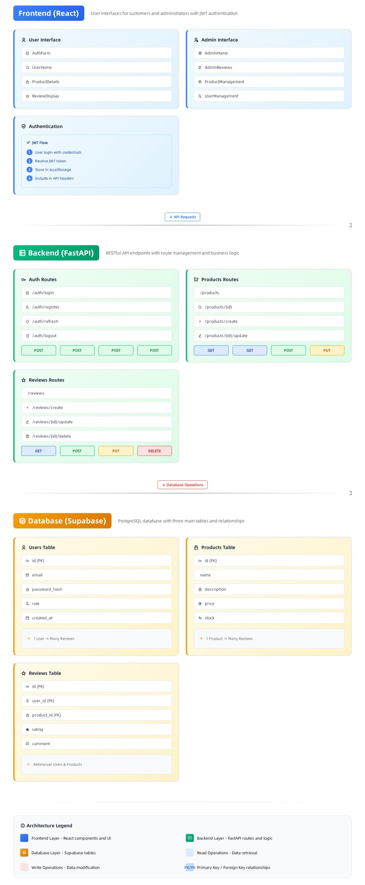

# ProUX — Full-stack Product Reviews App

> **ProUX** is a small full-stack application (frontend + backend) that lets users sign up / log in, browse products, add reviews, and — for admins — manage products and delete any review.

This README covers everything from **initial setup** to **running the app**, the **API** (endpoints + examples), and the **overall architecture**. It also includes troubleshooting tips and recommended next steps.

---

## Project Structure

```
project/
├─ backend/
│  ├─ main.py                 # FastAPI backend (endpoints, auth, supabase access)
│  ├─ .env                    # SUPABASE_URL + SUPABASE_KEY
│  ├─ requirements.txt        # Python dependencies
│  └─ utils/
│     └─ supabase_client.py   # create_client wrapper

├─ frontend/
│  ├─ package.json
│  ├─ src/
│  │  ├─ App.tsx
│  │  ├─ main.tsx
│  │  └─ components/          
│  └─ public/

# React components (AuthForm, AdminHome, UserHome, ProductDetails, AdminReviews, ProtectedRoute, theme-provider, mode-toggle)

```

---

## Tech Stack

* **Backend:** FastAPI (Python), Supabase (Postgres-like DB using Supabase + REST), jose (JWT), bcrypt (password hashing)
* **Frontend:** React + TypeScript, Vite, Tailwind-like components, ShadCn, React Router
* **Auth:** JWT bearer tokens (signed with `SECRET_KEY` in `main.py`)

---

## Environment & Configuration

**Backend (.env)** — required variables (already present in `backend/.env`):

```
SUPABASE_URL=<your-supabase-url>
SUPABASE_KEY=<your-service-role-or-api-key>
SECRET_KEY=<your-secret-key>
ALGORITHM=<hash-algorithm-code>
```

**Frontend**

* The front expects the backend running at `http://127.0.0.1:8000` (hard-coded in fetch calls). If you run backend elsewhere, update the fetch base URLs in `src/components/*` (or better: centralize into an `API_BASE` env variable).
* CORS in the backend is configured to allow `http://localhost:5173` (Vite dev URL). If you run frontend on another port, update `allow_origins` in `main.py`.

---

## Initial setup — Backend

1. Create a Python virtual environment and activate it:

```bash
cd backend
python -m venv .venv
source .venv/bin/activate      # on macOS / Linux
.venv\Scripts\activate         # on Windows
```

2. Install dependencies:

```bash
pip install -r requirements.txt
```

3. Configure `.env` (if not already):

```text
SUPABASE_URL=https://<your-supabase-project>.supabase.co
SUPABASE_KEY=<your-supabase-key>
```

4. (Optional) Set a secure JWT secret in `main.py` or export it as an environment variable and update `main.py` to read it.

5. If using Supabase local tables were not created, create the three tables described below in the Supabase SQL editor.

---

## Initial setup — Frontend

1. Install dependencies and start dev server:

```bash
cd frontend
npm install
npm run dev
# default: http://localhost:5173
```

2. If you want production build:

```bash
npm run build
npm run preview
```

---

## Run locally

Start backend (FastAPI / Uvicorn):

```bash
# from backend/
uvicorn main:app --reload --host 127.0.0.1 --port 8000
```

Start frontend (from frontend/):

```bash
npm run dev
open http://localhost:5173
```

Visit the app, sign up and log in. Admin users should be created with `is_admin=true` at signup to access admin endpoints.

---

## API Reference

> API docs URL: `http://localhost:5173/api.html` <br>
> Base URL (development): `http://127.0.0.1:8000`

### Auth

#### Method: `POST` Route: `/signup`

Create a user.

Request body (JSON):

```json
{
  "email": "alice@example.com",
  "password": "supersecret",
  "name": "Alice",
  "is_admin": false
}
```

Response (200):

```json
{
  "message": "Signup successful!",
  "access_token": "<jwt>",
  "token_type": "bearer",
  "user": { "id": 1, "name": "Alice", "email": "alice@example.com", "is_admin": false }
}
```

#### Method: `POST` Route: `/login`

Login and receive a JWT.

Request body:

```json
{ "email": "alice@example.com", "password": "supersecret" }
```

Response includes `access_token` and `user` object.

---

### Products

#### Method: `GET` Route: `/products`

List products. Query params supported: `search`, `sort_by` (default `created_at`), `order` (asc|desc).

Response:

```json
{ "data": [ { "id": 1, "name": "Product A", "description": "...", "price": "400" } ] }
```

#### Method: `POST` Route: `/products`  (Admin only)

Create product.

Header: `Authorization: Bearer <token>`

Body:

```json
{ "name": "New product", "description": "...", "price": "123" }
```

#### Method: `PUT` Route: `/products/{product_id}`  (Admin only)

Update product fields (partial allowed).

#### Method: `DELETE` Route: `/products/{product_id}`  (Admin only)

Delete a product.

---

### Reviews

#### Method: `GET` Route: `/products/{product_id}/reviews`

List reviews for a product. Supports `min_rating`, `max_rating`, `sort_by`, `order`.

Response:

```json
{ "data": [ { "id": 1, "product_id": 2, "user_id": 3, "name": "Bob", "rating": 5, "review": "Great!" } ] }
```

#### Method: `POST` Route: `/products/{product_id}/reviews`  (Authenticated)

Add a review for a product.

Header: `Authorization: Bearer <token>`

Body:

```json
{ "name": "Bob", "email": "bob@example.com", "phone_number": "1234567890", "rating": 5, "review": "Loved it" }
```

Response: created review object.

#### Method: `PUT` Route: `/reviews/{review_id}` (Authenticated — owner only)

Update your review.

#### Method: `DELETE` Route: `/reviews/{review_id}` (Authenticated — owner only)

Delete your review.

#### Method: `DELETE` Route: `/admin/reviews/{review_id}` (Admin only)

Admin may delete any review.

---

## Authentication & Authorization

* Backend uses JWTs signed with `SECRET_KEY` (HS256). The token's `sub` claim stores the user email.
* Frontend stores `access_token` in `localStorage` under `token` and the `user` object under `user`.
* For protected calls, the frontend sends header `Authorization: Bearer <token>`.
* `require_admin` dependency checks `user['is_admin']` and is applied to admin routes.

---

## Database schema expectations (Supabase)

Create these tables in Supabase (SQL editor or GUI):

### `users`

* `id` (int, pk)
* `name` (text)
* `email` (text, unique)
* `password` (text) — hashed string
* `is_admin` (boolean, default false)
* `created_at` (timestamp)

### `products`

* `id` (int, pk)
* `name` (text)
* `description` (text)
* `price` (text)
* `created_at`, `updated_at` (timestamps)

### `reviews`

* `id` (int, pk)
* `product_id` (int) — foreign key to products.id
* `user_id` (int) — foreign key to users.id
* `name`, `email`, `phone_number` (text)
* `rating` (int)
* `review` (text)
* `created_at`, `updated_at` (timestamps)

> Note: the backend uses Supabase python client `supabase.table("...")...execute()` calls. Adjust column names/types if you already have a different schema.

---

## Architecture — diagram & explanation



**Flow examples**
```
|- Sign up 
|  |- UI (POST /signup) 
|  |- backend hashes password 
|  |- inserts into `users` 
|  |- returns JWT
|
|- Add review
|  |- UI (with token) (POST /products/{id}/reviews) 
|  |- backend validates token 
|  |- inserts review with (user_id)
|
|- Admin create product
|  |- UI (POST /products) (admin with admin token) 
|  |- backend verifies (is_admin) 
|  |- inserts product
```

---

## Useful commands / quick checklist

```bash
# Backend
cd backend
python -m venv .venv
source .venv/bin/activate
pip install -r requirements.txt
uvicorn main:app --reload

# Frontend
cd frontend
npm install
npm run dev
```
---
